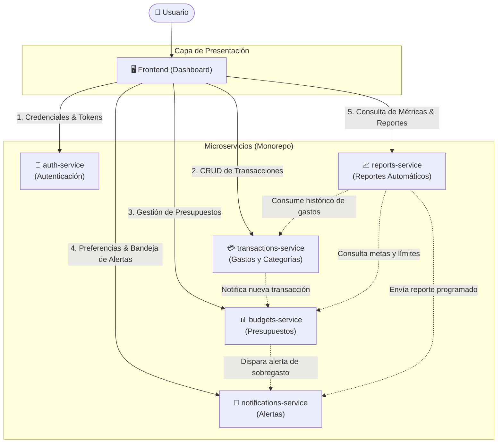

# Centavo 🪙

**Centavo** es una aplicación de finanzas personales diseñada para uso individual. Su objetivo es proporcionar control total sobre los ingresos y egresos diarios, permitir la planificación mediante presupuestos dinámicos y alertar proactivamente ante sobregastos, además de generar reportes automáticos de salud financiera.

El proyecto está organizado bajo una arquitectura de **monorepo con microservicios independientes** y un **frontend desacoplado (dashboard)**.

---

## 🏛️ Diagrama de Arquitectura

El siguiente diagrama ilustra la interacción entre el cliente (dashboard) y los diferentes microservicios independientes:



---

## 📦 Componentes del Sistema

Cada componente reside en su propia carpeta en la raíz del monorepo, manteniendo responsabilidades bien delimitadas:

### 1. `frontend/` (Dashboard Web)
* **Propósito:** Interfaz de usuario interactiva y responsiva para el control financiero individual.
* **Responsabilidades:**
  * Visualización rápida del balance, gastos recientes y estado de presupuestos.
  * Formularios ágiles para ingreso y categorización de transacciones.
  * Gráficas comparativas y visualización de reportes periódicos.
  * Centro de notificaciones para visualización de alertas en tiempo real.

### 2. `auth-service/` (Autenticación y Autorización)
* **Propósito:** Gestión de identidad y seguridad para el usuario.
* **Responsabilidades:**
  * Registro, inicio de sesión y validación de credenciales.
  * Emisión y verificación de tokens seguros (JWT / sesiones).
  * Gestión de perfil del usuario y claves de seguridad.

### 3. `transactions-service/` (Registro y Categorización)
* **Propósito:** Libro contable central para el registro de ingresos y gastos.
* **Responsabilidades:**
  * Registro, edición y eliminación de transacciones (monto, fecha, notas, método de pago).
  * Gestión de categorías y etiquetas (p. ej. alimentación, transporte, servicios).
  * Consulta, filtrado y búsqueda de movimientos por rango temporal o categoría.

### 4. `budgets-service/` (Presupuestos y Límites)
* **Propósito:** Planificación de metas y techos de gasto financiero.
* **Responsabilidades:**
  * Creación y administración de presupuestos (mensuales, semanales o por categoría).
  * Cálculo en tiempo real del porcentaje de consumo del presupuesto.
  * Detección de desviaciones y condiciones de sobregasto (ej. superar el 80% o 100% del límite asignado).

### 5. `notifications-service/` (Alertas y Avisos)
* **Propósito:** Motor de mensajería y alertas preventivas.
* **Responsabilidades:**
  * Recepción de eventos de sobregasto o proximidad al límite presupuestario.
  * Despacho de notificaciones por canales configurables (en la app, correo electrónico, etc.).
  * Historial de alertas emitidas y configuración de umbrales de aviso.

### 6. `reports-service/` (Reportes Automáticos)
* **Propósito:** Inteligencia y analítica periódica de hábitos financieros.
* **Responsabilidades:**
  * Generación programada de balances periódicos (semanales, mensuales y anuales).
  * Análisis de tendencias de gasto y sugerencias de optimización del ahorro.
  * Consolidación de datos de transacciones frente a presupuestos ejecutados.

---

## 📁 Estructura del Monorepo

```text
centavo/
├── frontend/               # Aplicación cliente / Dashboard
├── auth-service/           # Microservicio de Autenticación
├── transactions-service/   # Microservicio de Transacciones y Categorías
├── budgets-service/        # Microservicio de Presupuestos
├── notifications-service/  # Microservicio de Alertas y Notificaciones
├── reports-service/        # Microservicio de Generación de Reportes
└── README.md               # Documentación general del proyecto
```

---

## 🔄 Flujos Principales de Operación

1. **Registro de un Gasto:**
   - El usuario ingresa un gasto en el `frontend`.
   - `transactions-service` persiste la transacción y emite un evento/llamado a `budgets-service`.
   - `budgets-service` evalúa si la categoría ha alcanzado o superado su límite. Si se detecta un sobregasto, envía una señal a `notifications-service`.
   - `notifications-service` alerta inmediatamente al usuario.

2. **Cierre de Periodo y Reporte Automático:**
   - `reports-service` ejecuta una tarea programada (cron job) al final de cada semana o mes.
   - Agrega la información desde `transactions-service` y `budgets-service`.
   - Genera el balance del periodo y envía un resumen a través de `notifications-service` y el `frontend`.
